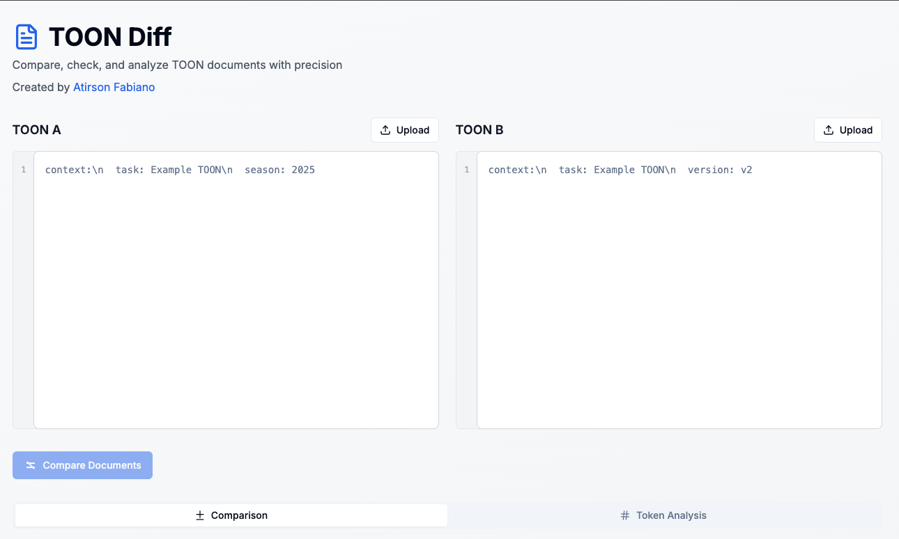
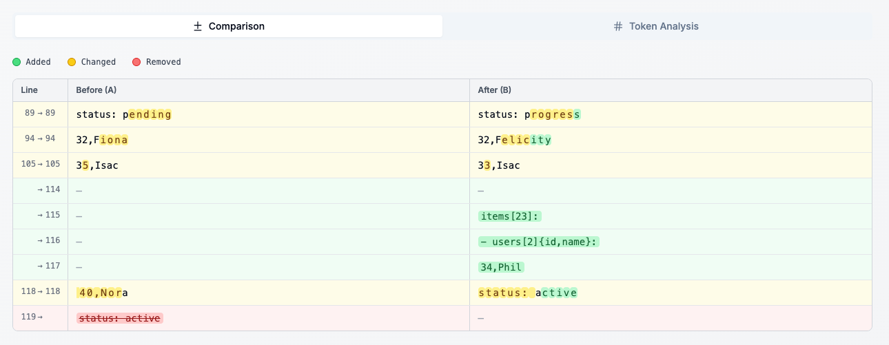
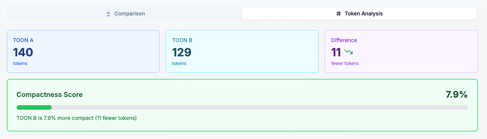

# TOON Diff & Validator

TOON Diff & Validator is an open-source web tool designed to **compare**, **validate**, and **analyze** TOON-based documents with precision.  
It includes a modern UI, syntax-aware comparison, token analysis, Firebase Analytics integration, and optional AdBlock detection.

---

## 📸 Screenshots

---

## 🚀 Features

### 🔍 Diff Comparison  
- Side-by-side or contextual diff  
- Highlights added, removed, and modified tokens  
- Smart comparison logic using custom tokenization  

### 🧪 TOON Validation  
- JSON/YAML-friendly validation  
- Detailed error messages  
- Real-time feedback  

### 🔢 Token Analysis  
- Token counting  
- Compactness scoring  
- Useful for optimizing prompt size or document weight  

### 📊 Firebase Analytics  
- Tracks page views  
- Tracks “Compare Documents” button clicks  
- Tracks tab navigation  

### 🛡️ AdBlock Detection  
- Detects if the user is blocking ads or analytics  
- Allows locking the UI with a custom message  
- Fully client-side detection

### 🎨 Modern UI  
- Built with **Next.js App Router**  
- Uses **Shadcn/UI** and **TailwindCSS**  
- Light mode enforced for a clean data-focused experience  

---

## 🧰 Tech Stack

| Area | Technology |
|------|------------|
| Framework | Next.js 14 (App Router) |
| UI | Shadcn/UI + TailwindCSS |
| Icons | Lucide |
| Analytics | Firebase Analytics |
| Language | TypeScript |
| Package Manager | npm / pnpm / yarn |
